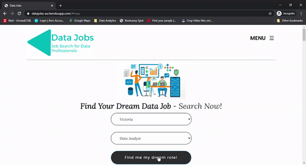

# Project 2: Data Jobs #
### A web app with interactive visualisations ###

Team members: 
- Amil Walgamage
- Jamie Tan
- Tas Tudor
- Babette Blanquet

This project provides insights into the Australian Data job market. You can check our [Data Jobs app](https://datajobs-au.herokuapp.com/) on Heroku.

### How to read our code: ###

The repository named 'Application' contains the following folders:
- app.py is the flask app which renders the data from the database
- a folder templates where sit the three webpages: index.html for the home page, about.html, team.html
- a folder static where sit: css/font/img/js/sass

In the js folder, you will find:
- config.js - app with passwords
- logic.js - code with the js functions rendering the visualisations
- script.js

In the sass folder:
- the scss files

### Snapshot of the Data Architecture to build the Data Jobs app: ###

### The visualisations ###

**An interactive map with the number of jobs and their locations**

**The number of job ads per weekday**

