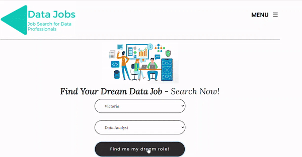
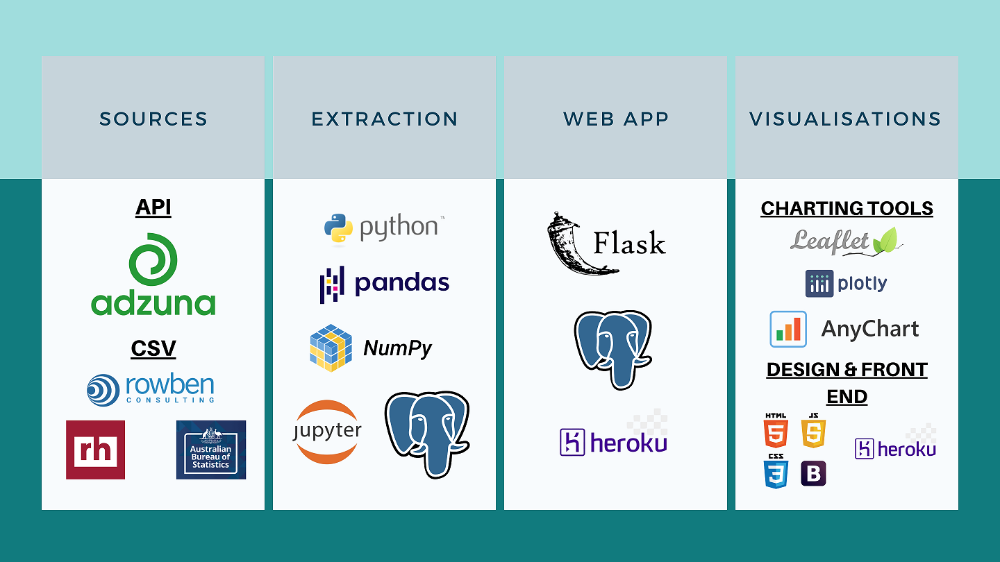
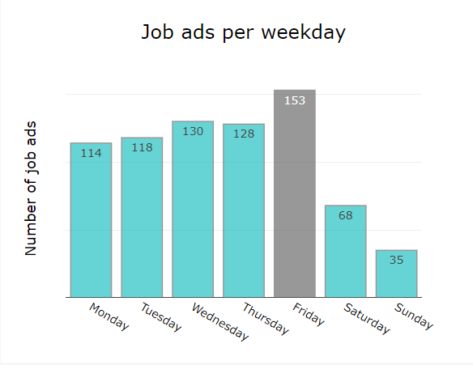
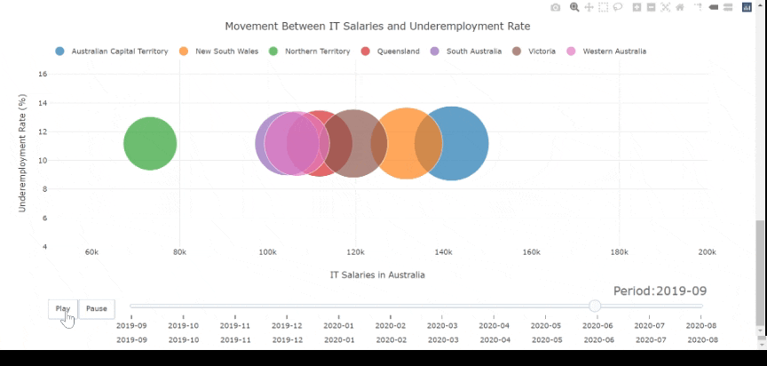

# Project 2: Data Jobs #
### A web app with interactive visualisations ###

**Team members:**
- Amil Walgamage
- Jamie Tan
- Tas Tudor
- Babette Blanquet

**Project Summary:**
This project provides insights into the Australian Data job market. 
You can check our [Data Jobs app](https://datajobs-au.herokuapp.com/) on Heroku.

**Project Problem Statement:**
There is not a specific jobs portal for data professionals.

**Desired Outcome:**
To build a live portal to provide current information and job listings to prospective data professional job seekers.

### How to read our code: ###

The repository contains the following folders:
- app.py is the flask app which renders the data from the database
- a folder templates where sit the three webpages: index.html for the home page, about.html, team.html
- a folder static where sit: css/font/img/js/sass
- requirements.txt with all the requirements for deployment on Heroku

In the js folder, you will find:
- config.js - app with passwords
- logic.js - code with the js functions rendering the visualisations
- script.js

In the sass folder:
- the scss files for the header and footer's fonts library.

### Snapshot of the toolbox used to build our app: ###

### The visualisations: ###

The visualisations update based on the selection of two filters: 
  - jobs
  - states

**An interactive map with the number of jobs and their locations:**

**The number of job ads per weekday:**

**Word Cloud:**

**Salary Benchmark:**

**Correlation between IT Salaries and underemployment rate:**

